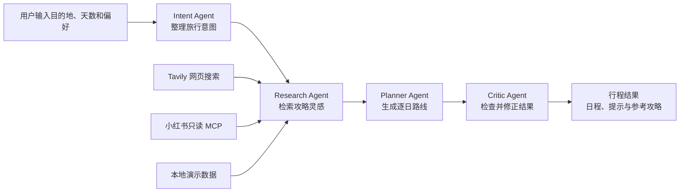

# KoreaMate

> 面向韩国自由行的 AI 旅行助手：韩语翻译、攻略灵感检索与可执行行程规划。

KoreaMate 是一个 React + NestJS 全栈项目。用户可以查询韩国城市与地点、获取旅行灵感、生成按天拆分的行程，并在行程规划过程中参考来自网页和小红书的攻略内容。

项目默认提供本地演示数据，因此不配置外部 API Key 也可以启动并浏览主要页面。配置 LLM、Tavily 或只读小红书 MCP 后，可以逐步替换本地 Provider，获得真实的内容检索与生成能力。

## 核心能力

| 模块 | 当前能力 | 数据来源 |
| --- | --- | --- |
| 韩语翻译 | 中文与韩语文本翻译页面、常用表达展示 | 本地 Provider，可接 OpenAI 兼容 LLM |
| 行程规划 | 根据目的地、天数、兴趣和备注生成逐日行程 | Intent、Research、Planner、Critic Agent |
| 攻略灵感 | 搜索和展示旅行攻略，支持来源筛选 | 本地数据、Tavily、小红书只读 MCP |
| 城市与地点 | 城市、景点和地点详情浏览 | 本地目录数据 |
| 收藏与历史 | 收藏地点、查看和删除浏览历史 | 当前为本地演示实现 |
| 任务状态 | 查询异步任务状态，通过 SSE 接收事件 | NestJS Task Service |

## 行程规划如何工作



Research Agent 会根据城市、兴趣和补充说明检索相关攻略。启用小红书服务后，它会调用“搜索笔记”，并对部分结果调用“分析笔记”；整理后的摘要会作为 Planner Agent 的参考资料，最终结果中同时保留参考攻略信息。

外部攻略只作为不可信参考数据，不会被当成系统指令执行。

## 技术栈

| 层级 | 技术 |
| --- | --- |
| 前端 | React、TypeScript、Vite、React Router、Tailwind CSS |
| 后端 | NestJS、TypeScript、RxJS |
| Agent | Intent、Research、Planner、Critic、Coordinator |
| LLM | OpenAI 兼容接口，可通过环境变量配置 |
| MCP | Model Context Protocol TypeScript SDK、项目内只读工具注册表 |
| 数据 | 当前默认使用内存数据；Prisma + PostgreSQL Schema 已预留 |
| 任务与队列 | SSE、BullMQ、Redis（基础设施已接入/预留） |
| 测试 | Jest、Vitest、Testing Library、Playwright |

## 项目结构

```text
KoreaMate/
├── frontend/                         # React 前端
│   ├── src/
│   │   ├── components/               # 布局和通用组件
│   │   ├── hooks/                    # 全局数据 Hook
│   │   ├── pages/
│   │   │   ├── discover/             # 城市、地点与攻略灵感
│   │   │   ├── profile/              # 收藏、历史和设置
│   │   │   ├── translation/          # 韩语翻译
│   │   │   └── travel/               # 行程创建与结果
│   │   ├── services/                 # API 与本地 Mock 适配
│   │   ├── storage.ts                # 浏览器本地状态
│   │   └── types.ts                  # 前端领域类型
│   ├── tests/e2e/                    # Playwright 端到端测试
│   └── package.json
├── backend/                          # NestJS 后端
│   ├── api/                          # Controller、DTO、中间件与异常处理
│   ├── agents/
│   │   ├── coordinator.ts            # Agent 工作流协调器
│   │   ├── intent.ts                 # 意图整理
│   │   ├── research.ts               # 攻略检索
│   │   ├── planner.ts                # 行程生成
│   │   ├── critic.ts                 # 结果检查
│   │   └── tools/                    # LLM、MCP 和内容 Provider
│   ├── services/                     # 翻译、发现、收藏、任务等服务
│   ├── mcp/xhs-readonly-server.ts    # 小红书只读 MCP 兼容层
│   ├── db/schema.prisma              # PostgreSQL 数据模型
│   ├── data/catalog.ts               # 本地演示目录数据
│   ├── test/                         # Jest 测试
│   └── docker-compose.yml            # PostgreSQL 与 Redis
├── docs/                             # 架构、API、数据库和安全文档
├── package.json                      # 工作区统一命令
└── README.md
```

## 快速开始

### 环境要求

- Node.js 20 或更高版本
- npm 10 或更高版本
- 可选：Docker Desktop，用于运行 PostgreSQL 和 Redis
- 可选：`uv`，启用小红书上游服务时需要

### 1. 安装依赖

在项目根目录执行：

```powershell
npm install
npm --prefix backend install
npm --prefix frontend install
```

根目录、前端和后端目前分别维护 `package-lock.json`。首次拉取项目时，分别安装可以确保三个工作区依赖完整。

### 2. 配置后端

PowerShell：

```powershell
Copy-Item backend/.env.example backend/.env
```

macOS/Linux：

```bash
cp backend/.env.example backend/.env
```

默认配置可以直接运行本地演示。不要把真实密钥或平台 Cookie 提交到 Git。

### 3. 启动前后端

```powershell
npm run dev
```

启动后访问：

- 前端：<http://localhost:5173>
- 后端：<http://localhost:3000>
- API 前缀：<http://localhost:3000/api/v1>

也可以分别启动：

```powershell
npm run dev:frontend
npm run dev:backend
```

> `npm run dev` 只启动 React 前端和 NestJS 后端，不会启动第三方小红书服务。

## 环境变量

配置文件位于 `backend/.env`。

| 变量 | 默认值/示例 | 用途 |
| --- | --- | --- |
| `PORT` | `3000` | NestJS 服务端口 |
| `FRONTEND_ORIGIN` | `http://localhost:5173` | 允许跨域访问的前端地址 |
| `COOKIE_SECRET` | 随机长文本 | Cookie 签名密钥，正式使用时必须更换 |
| `DATABASE_URL` | PostgreSQL URL | Prisma 数据库连接地址 |
| `REDIS_URL` | `redis://localhost:6379` | Redis/队列连接地址 |
| `LLM_BASE_URL` | 空 | OpenAI 兼容 API 地址 |
| `LLM_API_KEY` | 空 | LLM API Key |
| `LLM_MODEL` | 空 | LLM 模型名称 |
| `TAVILY_API_KEY` | 空 | Tavily 网页攻略搜索 |
| `AMAP_API_KEY` | 空 | 高德地图能力预留 |
| `SOCIALDATAX_API_KEY` | 空 | 社交数据 Provider 预留 |
| `REDFOX_API_KEY` | 空 | 酒店 Provider 预留 |
| `XHS_AUTOMATION_ENABLED` | `false` | 是否注册小红书只读 MCP |
| `FASTAPI_BASE_URL` | `http://localhost:8000` | 小红书上游 FastAPI 地址 |

环境变量为空时，对应外部 Provider 不会成为项目正常启动的前置条件。

## 启用小红书只读 MCP

### 能力边界

项目没有把上游全部 MCP 工具直接暴露给 Agent，而是通过 `backend/mcp/xhs-readonly-server.ts` 提供兼容层，只允许：

- `xiaohongshu_search_notes`：按关键词搜索公开笔记。
- `xiaohongshu_analyze_note`：读取并分析指定笔记。

发布笔记、评论、回复、点赞、关注、账号管理和监控等写操作均未注册，也不会被行程规划调用。

### 1. 安装 uv

Windows 可以执行：

```powershell
winget install --id astral-sh.uv
```

安装后重新打开终端，并确认：

```powershell
uv --version
```

### 2. 启动小红书上游服务

新开一个终端，在项目根目录执行：

```powershell
npm --prefix backend run xhs:server
```

服务默认监听 `http://localhost:8000`。当前上游包是独立的 Python/FastAPI 进程，所以这一步仍需单独启动；仅执行 `npm run dev` 不会自动拉起它。

### 3. 登录小红书

打开：

<http://localhost:8000/account/manage>

按页面提示完成登录，并确认账号显示为在线。登录产生的 Cookie 属于敏感信息，项目已忽略 `cookies/` 目录，不应复制到 README、日志或代码仓库中。

### 4. 开启项目侧 MCP

修改 `backend/.env`：

```dotenv
XHS_AUTOMATION_ENABLED=true
FASTAPI_BASE_URL=http://localhost:8000
```

然后重启 NestJS 后端。可以通过以下接口查看 MCP 注册状态：

```text
GET http://localhost:3000/api/v1/mcp/status
```

成功连接后，工具列表中只应出现前述两个只读工具。此后创建行程时，Research Agent 会尝试检索小红书内容，并把可用结果交给 Planner Agent。

### 当前限制

- 小红书可能触发验证码、风控或登录失效。
- 平台页面结构变化可能使上游自动化选择器失效，出现“账号在线但搜索结果为空”。
- MCP 可连接并不等于平台检索一定成功，应结合服务日志和实际返回结果判断。
- 上游 `xiaohongshu-automation` 声明仅限研究用途、禁止商业使用；正式商用前必须更换为获得明确授权的数据来源。
- 不应把小红书内容作为唯一依据。营业时间、价格、交通和预约规则仍需通过官方渠道核实。

更完整的权限设计见 [MCP 安全边界](docs/mcp-security.md)。

## 数据库与 Redis

PostgreSQL 和 Redis 的本地容器定义位于 `backend/docker-compose.yml`：

```powershell
docker compose -f backend/docker-compose.yml up -d
```

Prisma Schema 位于 `backend/db/schema.prisma`，相关命令：

```powershell
npm --prefix backend run prisma:generate
npm --prefix backend run prisma:migrate
```

当前 V0.1 默认仍以本地目录数据和内存服务保证演示流程可用；数据库 Schema、Prisma Client、BullMQ 与 Redis 是正式持久化和异步任务能力的基础设施。启动演示项目不要求先运行容器。

## API 概览

所有业务接口统一使用 `/api/v1` 前缀。成功响应格式为：

```json
{
  "success": true,
  "data": {},
  "requestId": "request-id"
}
```

失败响应格式为：

```json
{
  "success": false,
  "error": {},
  "requestId": "request-id"
}
```

| 方法 | 路径 | 说明 |
| --- | --- | --- |
| `POST` | `/translations/text` | 文本翻译 |
| `POST` | `/media-tasks` | 创建媒体处理任务 |
| `POST` | `/travel-plans` | 创建旅行计划 |
| `GET` | `/travel-plans/:id` | 查询旅行计划 |
| `GET` | `/tasks/:id` | 查询任务状态 |
| `GET` | `/tasks/:id/events` | 订阅任务 SSE 事件 |
| `GET` | `/cities` | 获取城市列表 |
| `GET` | `/cities/:id` | 获取城市详情 |
| `GET` | `/places` | 搜索地点 |
| `GET` | `/places/:id` | 获取地点详情 |
| `GET` | `/inspirations/search` | 搜索攻略灵感 |
| `GET` | `/inspirations/trends` | 获取热门灵感 |
| `GET` | `/mcp/status` | 查看 MCP Provider 与工具状态 |
| `GET/POST/DELETE` | `/favorites` | 管理收藏 |
| `GET/DELETE` | `/history` | 管理历史记录 |
| `GET` | `/me` | 获取当前访客信息 |

接口摘要见 [API 文档](docs/api.md)。请求参数与返回类型可以继续从 `backend/api/requests.ts`、`backend/api/types.ts` 和前端 `src/types.ts` 查看。

## 构建与测试

在项目根目录执行统一检查：

```powershell
npm run build
npm test
npm run lint
```

也可以分别运行：

```powershell
# 后端 Jest
npm --prefix backend test

# 前端 Vitest
npm --prefix frontend test

# 前端 Playwright 端到端测试
npm --prefix frontend run test:e2e
```

小红书单元测试使用模拟 MCP 响应，不要求测试期间连接真实账号。真实平台联调应单独进行，避免把验证码、Cookie 和第三方服务波动引入常规测试。

## 安全原则

- 密钥、Cookie 和登录凭证只保存在本地环境中，不提交到 Git。
- MCP 工具必须经过 `mcp-registry.ts` 注册和白名单检查。
- 社交平台 Provider 仅用于读取与研究，不执行发布、互动或账号操作。
- 外部网页和社交内容一律按不可信输入处理。
- 酒店能力仅允许搜索与详情查询，不执行预订和支付。
- AI 生成的行程需要人工核验签证、天气、票务、营业时间与安全信息。

## 当前阶段与后续计划

当前版本适合本地演示、功能验证和 Agent/MCP 集成实验。主要待完善事项包括：

- 将 PostgreSQL 和 Redis 从预留基础设施推进为默认持久化方案。
- 为小红书服务增加受控的进程托管和健康检查，减少手动启动步骤。
- 接入授权清晰、稳定可商用的攻略与 POI 数据源。
- 完善真实 LLM 翻译、行程质量评估和失败降级策略。
- 增加完整的身份认证、数据隔离和生产部署配置。
- 补充真实界面截图、在线演示与许可证说明。

## 文档

- [系统架构](docs/architecture.md)
- [API 摘要](docs/api.md)
- [数据库说明](docs/database.md)
- [MCP 安全边界](docs/mcp-security.md)

## 许可说明

当前仓库尚未提供独立的开源许可证。在许可证明确前，请不要默认项目代码或第三方数据可以用于再分发或商业用途。第三方服务仍受各自服务条款和许可证约束。
